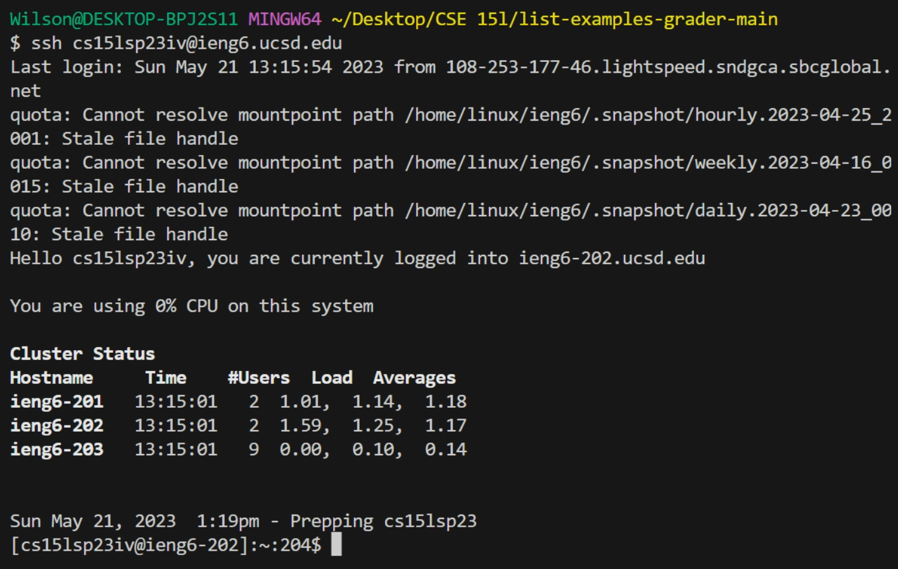
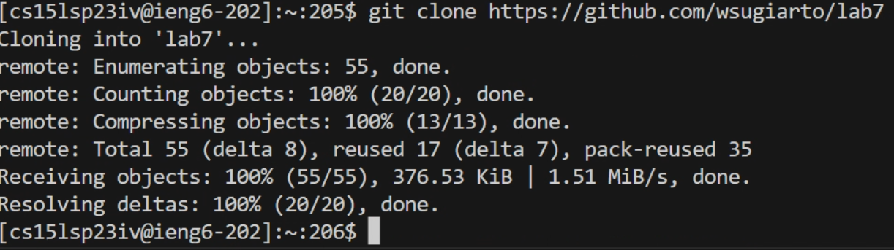
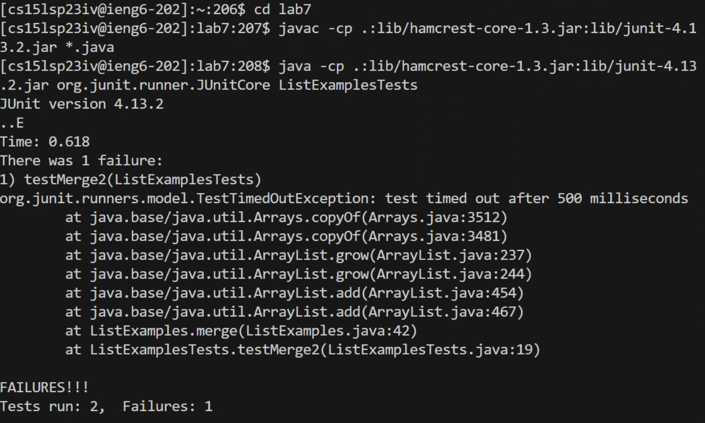
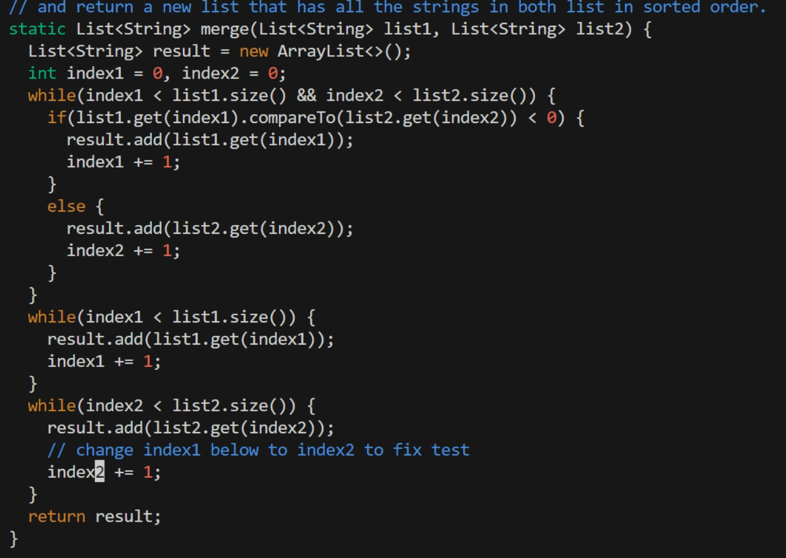
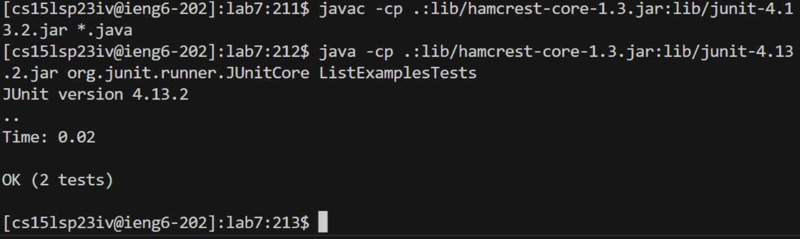
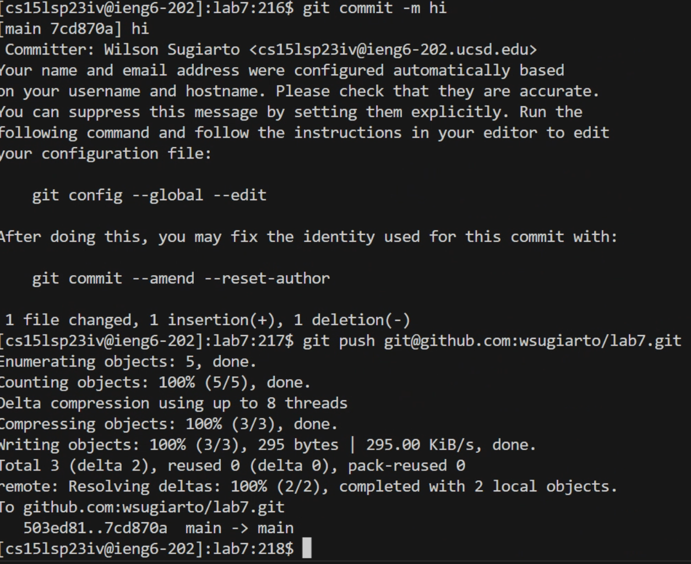

# Lab Report 4

## Step 4

Typed ssh cs15lsp23iv@ieng6.ucsd.edu `<enter>`
 
## Step 5
 
Typed git clone then CTRL C CTRL V (to paste https://github.com/wsugiarto/lab7)  `<enter>`

## Step 6

cd lab7 `<enter>`
CTRL C CTRL V (javac -cp .:lib/hamcrest-core-1.3.jar:lib/junit-4.13.2.jar *.java) `<enter>`
CTRL C CTRL V (java -cp .:lib/hamcrest-core-1.3.jar:lib/junit-4.13.2.jar org.junit.runner.JUnitCore ListExamplesTests) `<enter>`

## Step 7

vim ListExamples.java `<enter>`
/ x 1 `<ENTER>` 9 n e a `<BACKSPACE>` 2 : w q `<enter>`

## Step 8

`<up><up><up><enter>` (to get the javac for junit)
`<up><up><up><enter>` (to get the java for junit)

## Step 9

git add ListExamples.java `<enter>`
git commit -m hi `<enter>`
git push git@github.com:wsugiarto/lab7.git `<enter>`
